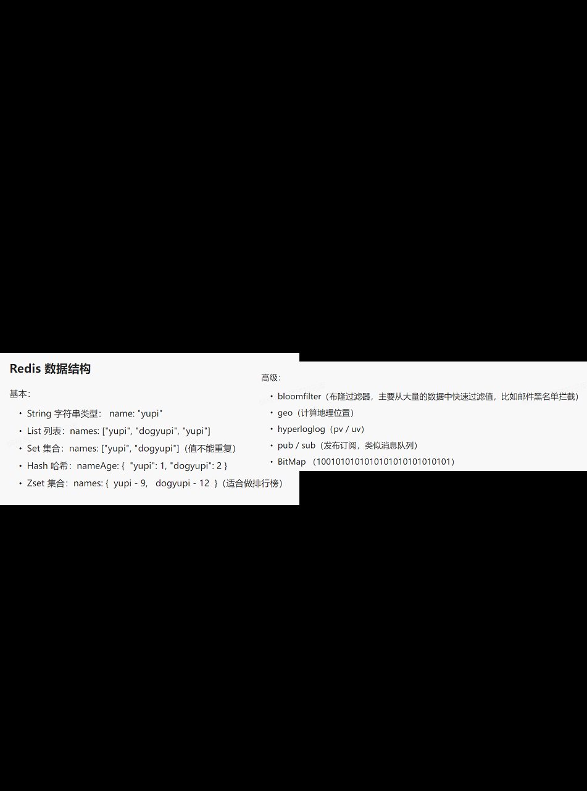

项目的目标是为一个线上学习系统扩展用户匹配的机制，用户可以根据自己的需求添加标签，标签的分类包括但不限于学习方向、工作类型、毕业学校等等，然后用户根据标签搜索到其他用户从而进行组队。用户可以自己创建队伍并且为自己的队伍添加标签、也可以根据标签查询队伍并且加入，并且可以邀请其他用户加入。

后端技术选择：1. 语言用的是Java，框架是SpringBoot；2. 添加的组件有SpringMVC + MyBatis + MyBatis Plus(提高开发效率)；3. 数据库是MySQL；4. 缓存是Redis；5. 用了Swagger 和 Knife4j接口文档

后端开发：
1.	首先是数据库的设计：基于原系统的用户表（包括用户账号、密码、昵称、电话、邮箱、以及用户角色等）。然后创建标签表，标签表的用来分类标签的字段有性别、学习方向、学习目标、学习等级等。主键是表ID，其余字段还有标签名、上传标签的用户ID、父标签ID等。用gson将json字符串反序列化为java对象，然后在后端接口开发时用SQL语句查询多个或单个标签。再然后是队伍表包括队伍ID、队伍名称、队伍描述、最大人数等。最后就是用户-队伍关系表，也就是存储用户加入和创建的队伍。
2.	Session（用户登陆信息）共享：为了让多个服务器的用户信息统一，这里使用共享存储也就是把数据放到同一个地方去集中管理。这里我选用的是Redis缓存。
3.	Redis缓存：再就是因为用户信息的读取以及是否登录的判断非常频繁，所以使用Redis缓存（存储键值对），可以提前把数据取出来保存好，就不用再查询数据库了，可以更快地读写。具体做法首先是要引入Redis的starter依赖（从而可以操作Redis），然后引入spring-session和redis的整合依赖（从而可以自动将session存储到redis中）。然后把spring-session的存储配置store-type修改为redis，表示从redis读写session。然后为了防止写入Redis的数据乱码和浪费空间，可以自定义一个序列化器，从而提供一个序列化的模板。再然后，为了用JAVA操作Redis，引入一个通用的数据访问框架Spring Data Redis，这个框架定义了一组增删改查的接口，具体步骤是先引入依赖，然后配置Redis地址（包括Redis服务器监听的端口号，主机以及数据库的编号）。再然后把用户ID作为缓存键以确保不同用户看到的数据不同。
4.	下一步是实现缓存预热，这是为了防止即使用了缓存，但第一个用户访问的还是很慢的情况。我用了定时任务去实现，也就是每天刷新一次缓存列表。这里使用Spring Scheduler———就是SpringBoot默认已经整合的一种技术（具体做法是在主类上开启@EnableScheduling，然后给要定时执行的方法添加@Scheduling注解，cron表达式或者执行频率）。为了防止资源浪费和脏数据的插入，这里还要确保定时任务同一时间只能在1个服务器上执行，所以使用Redisson分布式锁去实现（引入依赖、使用redisson创建分布式列表、然后在定时任务执行时用redissonClient.getLock函数获得锁，确保只有一个线程能获取锁并且只能释放自己的锁，要执行的方法放在try()中，释放锁放在finally()中。其他线程的watiTime设置为0，表示只抢占一次锁，抢不到就放弃。还使用了Redisson的Watchdog，就是开一个监听线程，如果方法还没执行完，就重置锁的过期时间）。
5.	导入数据：因为该系统中用户登录以及查询标签涉及频繁的建立和释放数据库的链接，所以这里使用批量查询和并发执行。（具体做法是建立线程池ThreadPoolExecutor以及编写for循环插入数据）
6.	组队功能开发：用户可以创建一个队伍，设置队伍的人数、队伍名称(标题)、队伍描述、超时时间、公开或私密。用户根据名称搜索队伍，然后系统展示队伍列表，信息流中不展示已过期的队伍修改队伍信息。用户可以加入队伍(其他人、未满、未过期)，允许加入多个队伍，但是有上限。用户也可以退出队伍(如果队长退出，权限转移给第二个加入的用户)，然后队长可以解散队伍。再就是分享队伍功能，可以生成分享链接，用户点击链接即可加入。
7.	具体接口设计：
	创建队伍接口：首先判断web请求值是否为空。然后判断是否登录，未登录不允许创建。然后校验信息有：队伍人数限值，队伍标题长度，描述，status是否公开，如果不公开，则有密码，并且密码长度也要校验，然后超时时间要大于当前时间。插入队伍信息。最后插入用户信息。
	查询队伍接口：从请求参数中取出队伍名称等查询条件，不展示已过期的队伍（这个是根据过期时间筛选的)。可以通过某个关键词同时对名称和描述查询，只有管理员才能查看加密还有非公开的房间。
	修改队伍信息接口：判断请求参数是否为空，只有管理员或者队伍的创建者可以修改，如果用户传入的新值和旧值一致，就不用更新数据了，从而降低耗时，如果队伍状态改为私密，要添加密码。最后更新数据库。
	用户加入队伍接口：队伍必须存在，只能加入未满、未过期的队伍。不能加入自己的队伍，不能重复加入已加入的队伍（这是保证了幂等性)。如果加入的队伍是私密的，要输入密码。
	退出队伍接口：请求参数为队伍 id，首先校验请求参数，然后校验队伍是否存在。校验目前用户是否已加入队伍。如果队伍只剩—人，队伍直接解散。如果还有其他人并且是队长退出队伍，权限转移给第二个加入的用户，如果不是非队长，直接在队伍表中删除当前用户信息。
	解散队伍接口：请求参数是队伍 id，校验请求参数，校验队伍是否存在。校验当前是不是队伍的队长，如果是则移除所有加入队伍的关联用户的信息，最后删除队伍。
	获取当前用户已加入的队伍的接口：这个直接getByID就可以，如果队伍不存在就抛出异常。
	然后这里各个请求参数要包装成类，这样返回给前端更便于理解。 
8.	最后是用户匹配功能：找到共同标签最多的用户，共同标签越多，在列表中排的越靠前，如果没有匹配的用户，则随机推荐几个。这里用到了动态规划实现的最小编辑距离算法，这里编辑距离就是当前用户标签转化其他用户标签的最小操作数（操作的类型有：添加、修改和删除）。

接口文档：
1.	接口信息包括请求参数、响应参数、错误码、接口地址、接口名称、请求类型、请求格式、备注。
2.	步骤：引入Swagger或者Knife4j依赖，定义Swagger配置类，在controller层定义需要生成接口文档的代码位置，并且添加注解来自定义接口描述信息。最后运行项目，在web中查看接口文档。
